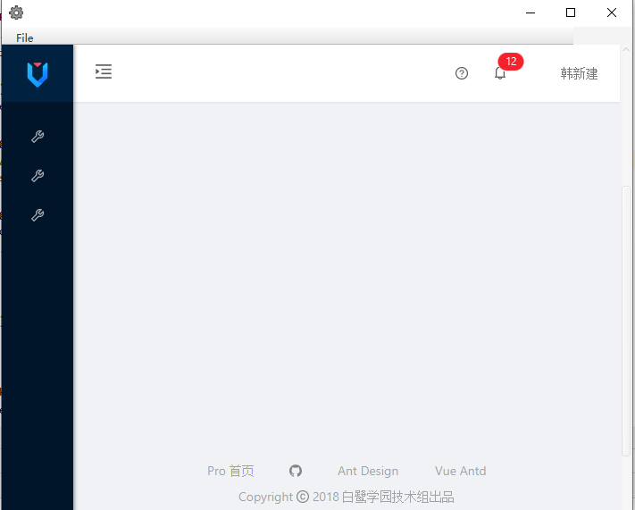
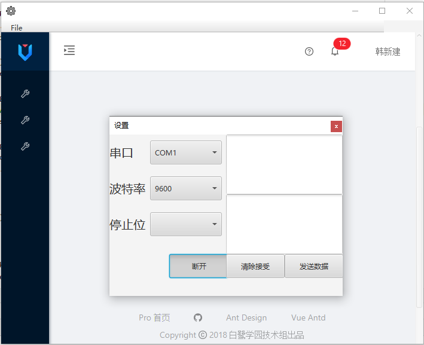

# javaFx 串口 web 

一个使用 `javfx` 技术编写的本地串口通信、内嵌web的例子。

## 功能介绍

1. 这个javaFx的应用程序
2. 内嵌 web 网页
3. 使用串口进行本地接口通信
4. 实现 web 内的 js 与JAVA的交互


## 技术栈

- `javafx` 
- `spring-boot`
- [`springboot-javafx-support`](https://github.com/roskenet/springboot-javafx-support)
```xml
<dependency>
    <groupId>de.roskenet</groupId>
    <artifactId>springboot-javafx-support</artifactId>
    <version>2.1.6</version>
</dependency>
```
- [`spring-boot-starter-rxtx`](https://github.com/han1396735592/spring-boot-starter-rxtx)

```xml
<dependency>
    <groupId>cn.qqhxj.common</groupId>
    <artifactId>spring-boot-starter-rxtx</artifactId>
    <version>1.3.1-RELEASE</version>
</dependency>
```
## 效果


